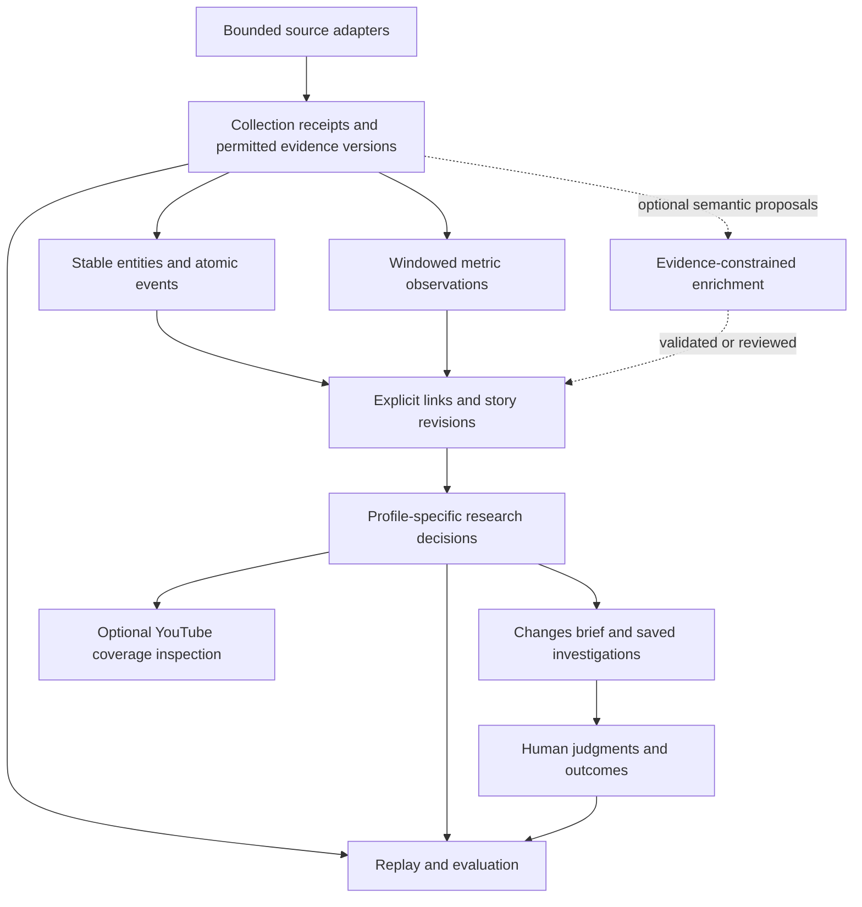

# Strategic review: evolving AI Trend Radar into developer intelligence

## Status update — September 7, 2026

This is a historical strategic review of `a086a8d`, not the current implementation
inventory. The active agreed plan is [Developer-first redesign](developer-first-plan.md).
Its audience, scoring and delivery decisions supersede conflicting recommendations
below. Historical external research has not been re-verified in this update.

September 8 release update: the developer-first redesign is included in v0.3.0.
See [release notes](../RELEASE_NOTES.md) for current behavior and migration guidance;
the comparison below preserves the September 7 planning snapshot.

Checked against the v0.2.0 source and release notes:

| Area | Shipped through v0.2.0 | New redesign |
|---|---|---|
| Identity | Repo/CLI/package renamed to AI Trend Radar | Keep names and checkout path |
| LLM | Optional isolated Codex extraction, bounded calls and versioned caches | Assess every existing source family |
| Evidence | Complete GitHub notes and up to five selected HN linked pages; literal quote checks | Add bounded official articles, README/model cards and explicit evidence types |
| Report | LLM updates first, globally numbered, comparison table | One developer-focused list |
| Scoring | Impact/demo/freshness/audience each /100, weights 30/30/20/20 | Impact/relevance/urgency at 50/30/20; no video score |
| Review | Event-level decisions and researcher feedback | Individual developments; preserve legacy history |
| Delivery | Changes-only brief and optional Slack | Same developments as the unified report |
| Discovery | Established-repository tracking alongside existing providers | Consequence-aware selection before presentation cutoffs |
| Evaluation | Standalone extraction comparison harness | Developer-first fixtures and isolated review scan |
| Versions | Report 2.3, database 2, Discovery Priority v1.1 | Report/brief 3.0 and database 3 |

In particular, “No runtime LLM,” “Do not build yet: LLM enrichment,” and references
to future Slack/feedback support below describe the September 6 baseline, not
v0.2.0. The previous LLM/scoring/HN changes were documented in
[release notes](../RELEASE_NOTES.md), but had not been reconciled into this roadmap.

---

**Review date: September 6, 2026**  
**Repository reviewed: `a086a8d`**  
**Horizon: September 2026–September 2028**

## 1. Executive verdict

**The strongest product is an evidence-backed research system for developing AI/developer stories. Its primary job should be helping technical publishers and developer educators decide what deserves investigation now.**

The current repository is a useful starting point for that product. It is not yet a trend-intelligence system in the stronger sense: it cannot reliably distinguish sustained momentum from accumulated activity, remember how an investigation developed, or demonstrate that its recommendations improve a researcher’s decisions.

The strategic change I recommend is:

> Organize the product around meaningful changes in what a researcher knows—and what those changes make worth investigating.

That requires persistent event identity, trustworthy observation history, source attribution, revisable story links, and evaluation. It does **not** initially require a graph database, mandatory LLM, hosted service, or dozens of integrations.

Five conclusions drive this review:

1. **Preserve the evidence discipline.** Real timestamps, explicit uncertainty, failure isolation, downstream YouTube evidence, and refusing to fill weak Top-N lists are valuable.
2. **Repair the temporal foundations before adding intelligence.** I confirmed behavior that repeatedly makes old accumulated growth appear completely fresh.
3. **Replace platform-count “confirmation” with claim-specific evidence relationships.** An announcement appearing on GitHub and Hacker News is not necessarily independently verified.
4. **Make persistent investigations the eventual user-facing unit.** Keep atomic events underneath them.
5. **Build the evaluation system before deciding that semantic enrichment, additional sources, or a broader audience improves the product.**

**There is no meaningful moat today.** A credible future advantage would be a trusted, longitudinal record of developer changes, corrected story histories, and public evidence that the system improves research decisions.

### Evidence and limits

I inspected all application modules, tests, configuration, documentation, CI, and relevant Git history; audited the 19 saved reports; and queried the local database read-only. I ran the credential-free suite: **73 tests passed**. CLI help also worked. Production code and tracked files remained unchanged during the review; I did not run a live scan.

The local database contains 19 scans: 18 on September 1 and one on September 4. That is development evidence, not a longitudinal product evaluation.

Throughout this report:

- **FACT** means supported by repository inspection, execution, or a cited external source.
- **INFERENCE** means my interpretation or recommendation.
- **FORECAST** means a conditional expectation for the next 12–24 months.

External sources were researched as of September 6, 2026. Living product documentation establishes documented capabilities, not independently verified customer outcomes. No interviews or competitive product trials were conducted.

---

## 2. What the product actually is today

**FACT:** This is a single-process Python CLI for selecting fresh AI/developer research candidates and attaching YouTube search evidence.

Its implemented flow is:

1. Collect configured official feeds, watched GitHub repositories/releases, exploratory GitHub results, Hacker News submissions, and Hugging Face models/Spaces.
2. Record source items and numeric observations.
3. Resolve configured entity aliases and apply keyword relevance rules.
4. Construct event candidates using URLs, release identifiers, anchors, time proximity, and title similarity.
5. Assign freshness, evidence strength, and an interest band.
6. Apply community, release-topicability, and main-list presentation gates.
7. Attach bounded YouTube searches to selected candidates.
8. Write Markdown/JSON reports and a scan record.

The current priority formula is:

```text
0.60 × Freshness + 0.25 × Evidence Strength + 0.15 × Interest
```

The pipeline is explicitly optimized for a creator deciding what to inspect, not for predicting video performance. [Current pipeline](../src/ai_trend_radar/pipeline.py)

### Intentional boundaries

The repository deliberately has:

- No runtime LLM or embedding model.
- No calibrated momentum, novelty, or opportunity predictor.
- No automatic YouTube saturation judgment.
- No persistent story graph or investigation workflow.
- No historical reconstruction of unobserved engagement.
- No dashboard, notification system, or scheduler.
- No learned personalization or recommendation-outcome feedback.

Those boundaries were sensible for the documented “smallest robust end-to-end V1.” They should not all become permanent product principles.

### What “event-first” currently means

There is a useful distinction between repository snapshots and actual releases or growth triggers. However, candidates are reconstructed in memory for each scan. The product does not yet have a durable event registry with stable identities, revisions, corrections, and relationships.

Likewise, Release Watch and Community Watch are **report partitions**, not persistent watch objects. The system does not remember that a researcher deferred an item, why they deferred it, or what evidence should reopen it.

**INFERENCE:** Today’s most accurate abstraction is **a deterministic research shortlist generator**. Calling it an intelligence system is an ambition that still needs to be earned.

---

## 3. Strengths worth protecting—and weaknesses that change the roadmap

### Design decisions

| Current decision | Classification | Recommendation |
|---|---|---|
| Event-first discovery | **KEEP** | Anchor intelligence in occurrences and evidence. Add stories above events. |
| Real publication and observation timestamps | **KEEP** | Preserve the principle; repair fallback and cache-time semantics. |
| Growth only after tracking begins | **KEEP** | Preserve historical honesty; distinguish cumulative growth from current momentum. |
| Explainable deterministic ranking | **EVOLVE** | Keep a reproducible baseline, but replace the universal ranking policy gradually. |
| Provider failure isolation | **KEEP** | Extend it with per-item data age, coverage gaps, and bounded execution. |
| Conservative deduplication | **EVOLVE** | Preserve caution while adding stable IDs, explicit incompatibilities, and reversible links. |
| Evidence provenance | **EVOLVE** | Move from links and report payloads to versioned evidence and decision lineage. |
| Deterministic release-topic extraction | **EVOLVE** | Keep it as a cheap baseline; improve source completeness before adding models. |
| Release Watch / Community Watch | **EVOLVE** | Turn them into persistent states with explicit reconsideration conditions. |
| Refusing forced Top-N results | **KEEP** | Never turn result count into a quality target. |
| YouTube as downstream evidence | **KEEP** | Creator coverage is a separate decision input. |
| Human final judgment | **KEEP** | Capture judgments and reasons so the system can improve. |
| No mandatory LLM | **KEEP** | Change “no LLM” into “optional, evaluated semantic enrichment.” |
| Source-family count as independent confirmation | **REPLACE** | Track origin, ownership, derivation, and the particular claim supported. |
| Latin-script ratio as a global discovery gate | **REPLACE** | Separate source language from output language and audience relevance. |
| Semantic linking and narrative detection | **EXPERIMENT** | Require measurable improvement over exact identifiers and lexical retrieval. |

### The most consequential findings

#### A. Accumulated growth can become permanently fresh

**FACT:** Observed growth is calculated against the earliest stored observation. Once a watched repository crosses the absolute, relative, and duration thresholds, each qualifying scan creates a growth event timestamped with the current observation time.

I reproduced this with an unchanged star count:

| Time after initial qualifying observation | Additional stars | Freshness | Priority |
|---|---:|---:|---:|
| Immediately | 0 | 100 | 88.75 |
| 24 hours later | 0 | 100 | 88.75 |
| 240 hours later | 0 | 100 | 88.75 |

This is not invented historical growth—the original increase really was observed. But it **misrepresents an old accumulated increase as a new development**. [Growth calculation](../src/ai_trend_radar/db.py), [event trigger](../src/ai_trend_radar/ranking.py)

**Consequence:** Long-running operation can become less informative even while the database accumulates more observations.

#### B. Distinct events already share candidate IDs

**FACT:** The September 4 report contains ten recommendations but only eight distinct fingerprints. Different Codex releases share one fingerprint; different Claude Code releases share another.

The fingerprint uses the first sorted anchor. A shared feature or model anchor can precede the release-specific anchor and collapse identity without actually merging the candidates. [Fingerprint implementation](../src/ai_trend_radar/resolution.py)

**Consequence:** These IDs cannot safely support saved investigations, feedback, alert deduplication, or event timelines.

This is a foundational product issue, not a cosmetic hashing improvement.

#### C. Repository attention is attributed too freely to individual releases

**FACT:** Repository snapshots are attached to release candidates. Their cumulative star delta can make every associated recent release “strong” interest, including a release with no extracted standalone angle.

In the September 4 report:

- All ten recommendations have only one source family.
- Six use the GitHub star-delta rule for their interest classification.
- A low-specificity Codex release is promoted by that rule.

[Saved September 4 report](../reports/scan-20260904T130401.021295Z-21773ea3b5.json)

**INFERENCE:** The current system conflates attention to a project with interest in a particular release. It should show repository growth as contextual evidence unless a defensible relationship to the event is established.

#### D. “Independent confirmation” is overstated

**FACT:** Two source families are sufficient to trigger independence-related labels and promotion conditions.

But these situations differ:

- A maintainer posts the same announcement on two platforms.
- Someone submits that announcement to HN.
- An independent developer publishes a working reproduction.
- A separate evaluator contradicts the advertised benchmark.

The first two establish distribution or attention. The latter two can establish independent evidence about a capability.

**Consequence:** Platform count currently influences evidence, interest, and presentation—reusing essentially the same signal in several places.

#### E. The product has a much narrower main-list time window than its seven-day lookback suggests

**FACT:** With a 48-hour half-life and a freshness floor of 40, an event falls below the main-list gate after approximately **63.45 hours**, regardless of interest strength.

A technically important development can therefore disappear from the primary list before someone has time to test it.

**INFERENCE:** A single freshness deadline is a poor fit for releases, emerging projects, research results, deprecations, and developing workflows. Their useful decision windows differ.

#### F. Persistence cannot support complete replay

**FACT:**

- `source_items` overwrites its current payload.
- `observations` stores numeric metrics, not historical source text.
- HTTP cache entries are replaceable.
- Reports preserve selected outputs, not every intermediate decision.
- A configuration fingerprint is stored, but not a complete effective execution manifest.
- All 19 local scans use scoring version `v1.0`, despite substantial development across those scans.

[Persistence model](../src/ai_trend_radar/db.py)

**Consequence:** A report can explain parts of an output, but cannot reliably reconstruct everything the system knew and did at that point.

#### G. Semantic understanding is missing, but input loss comes first

**FACT:** Release summaries are normalized and truncated to 2,000 characters. Twenty current source records reach that limit.

The topic extractor favors qualifying sections and bullet order; it does not assess which change produces the most useful developer story. It operates on GitHub releases, while general official announcements do not pass through equivalent topic extraction. [Topic extraction](../src/ai_trend_radar/topics.py)

**INFERENCE:** Adding an LLM to truncated notes would automate an incomplete view. Preserve permitted full content and structure first.

#### H. Discovery is biased toward sources that are already easy to recognize

The shipped configuration has three official feeds, six watched repositories, and four recent-creation GitHub query packs. HN uses bounded list slices; Hugging Face starts with its existing trending order.

**FACT:** HF results receive positions within the returned model/Space lists. Because the default lists contain fewer than 100 items, every otherwise relevant and fresh returned HF item meets the top-100 rank eligibility alternative. Many also receive moderate or strong interest through that inherited rank.

**INFERENCE:** Some “discovery” is a repackaging of upstream selection. Older projects becoming newly relevant, unfamiliar terminology, non-Latin descriptions, and important hosted-product changes can be missed.

The passing tests establish consistency with the implemented rules. They do not establish that those rules identify good research opportunities.

---

## 4. The September 2026 landscape

### Relevant competitors and adjacent products

**FACT:** Much of the obvious expansion path already exists elsewhere.

| Product/project | Documented capability | Strategic implication |
|---|---|---|
| **Feedly Market Intelligence** | Emerging-trend dashboards, entity insight cards, cited synthesis, newsletters, integrations | “Collect sources and summarize emerging trends” is an established commercial category. [Feedly](https://feedly.com/market-intelligence) |
| **daily.dev** | Personalized developer feeds, briefings, search, saved content, and documented agent-facing features | A general developer news feed competes with existing habits and distribution. [daily.dev features](https://daily.dev/features/) |
| **vidIQ Outliers** | Channel-relative video performance discovery and filtering | Avoid rebuilding downstream video-performance research. Find useful technical developments before that evidence accumulates. [vidIQ documentation](https://support.vidiq.com/en/articles/9660010-outliers) |
| **Exploding Topics** | Announced daily GitHub Trending ingestion on August 19, 2026 | GitHub ingestion itself is no longer distinctive, even among broad trend products. [Product announcement](https://explodingtopics.com/blog/new-trend-data-sources) |
| **OSSInsight** | Open-source GitHub activity analysis, comparisons, trending, and AI/developer collections | Do not build a comprehensive GitHub analytics warehouse as the next step. [Project README](https://github.com/pingcap/ossinsight/blob/main/README.md) |
| **sansan0/TrendRadar** | RSS/trending aggregation, optional AI, SQLite, scheduling, notifications, reports, and MCP access | Open source, optional AI, alerts, and agent access are useful properties; they are not differentiation by themselves. [TrendRadar](https://trendradar.sandev.cc/en/) |
| **Common Room** | Identity resolution and multi-source signals attached to contacts and organizations | Its useful lesson is attaching evidence to a concrete decision object. Its sales/CRM scope should not be copied. [Core concepts](https://www.commonroom.io/docs/get-started/core-concepts/) |
| **Brandwatch** | Broad social research, historical data, filtering, and integrations | Comprehensive social listening involves access and operational advantages this project does not possess. [Consumer Research](https://www.brandwatch.com/products/consumer-research/features/) |
| **Thoughtworks Technology Radar** | Practitioner assessments and actionable adoption categories | Technical judgment is a different product from attention measurement. [Technology Radar](https://www.thoughtworks.com/radar) |

Except where dated above, these are living product pages inspected in September 2026. Their advertised performance claims are not treated as independently established outcomes.

**INFERENCE:** The defensible opening is narrower than “AI Developer Intelligence Platform”:

> A researcher can inspect an evolving technical story, understand the evidence behind each change, and see why it has become worth testing or explaining.

### Ecosystem changes that matter

**1. Background agents are a shipped workflow.**

Cursor’s June 2, 2026 engineering account describes unattended cloud agents running in dedicated environments, with durable execution and recovery requirements. This creates relevant developments in execution environments, permissions, observability, evaluation, and integration—not only model releases. [Cursor engineering account](https://prod.cursor.com/blog/cloud-agent-lessons)

**2. Developer tools increasingly appear as integrations and capability packages.**

GitHub announced marketplace agent apps on June 2, 2026. The official MCP Registry launched in September 2025, while Agent Skills documents a portable format for instructions and supporting resources. [GitHub announcement](https://github.blog/changelog/2026-06-02-extend-github-with-agent-apps/), [MCP Registry announcement](https://blog.modelcontextprotocol.io/posts/2025-09-08-mcp-registry-preview/), [Agent Skills](https://agentskills.io/home)

A2A also provides a distinct agent-communication and discovery specification. These protocols should be tracked as different ecosystem artifacts; their existence does not establish adoption or quality. [A2A specification](https://a2a-protocol.org/latest/specification/)

**3. Open-model identity needs lineage.**

Hugging Face model-card metadata supports base-model relationships, quantizations, adapters, licenses, and newer versions. Counting each repository as an independent new model discards available structure. [HF model-card documentation](https://huggingface.co/docs/hub/model-cards)

**4. Popularity is vulnerable to manipulation.**

The ICSE 2026 study *Six Million (Suspected) Fake Stars on GitHub* documents suspicious promotion patterns and explicitly acknowledges false-positive risks. Stars should represent observed attention, not adoption, quality, or confirmed integrity. [Original study](https://cmustrudel.github.io/papers/icse2026fakestars.pdf)

**5. Capability claims and measured developer benefit remain different.**

METR’s February 24, 2026 update explains why selection effects and parallel-agent workflows made its follow-up productivity estimate unreliable. This is a strong reason to preserve the distinction between “released,” “claimed,” “demonstrated,” and “independently measured.” [METR update](https://metr.org/blog/2026-02-24-uplift-update/)

**6. New terminology is not necessarily new capability.**

Thoughtworks’ April 15, 2026 Radar announcement highlights unstable terminology and “semantic diffusion.” A novelty detector that rewards new phrases could amplify renaming instead of detecting substantive change. [Thoughtworks announcement](https://www.thoughtworks.com/about-us/news/2026/combat-ai-cognitive-debt-radar-v34)

### 12–24 month forecast

| Forecast | Confidence | Architectural response |
|---|---|---|
| More discovery will happen inside coding agents and development workflows | Medium–high | Stable IDs, versioned JSON, composable queries; add agent adapters when requested by real users |
| Generated repositories, releases, and commentary will increase the cost of distinguishing signal from repetition | Medium | Preserve origins, derivation, material changes, and uncertainty |
| Workflow improvements will frequently come from combinations of tools rather than one headline model release | Medium | Support relationships among models, runtimes, integrations, and availability events |
| Generic summaries will become less differentiating | High | Invest in evidence history and decision-changing updates |
| Access conditions and metrics will continue changing | High | Version metric definitions and source policies; isolate adapters |
| Creator value will depend partly on explanation, testing, and audience fit rather than simply being first | Medium | Evaluate research usefulness separately from detection speed |

These forecasts do not establish that a particular protocol will dominate or that autonomous development will become universal.

---

## 5. Positioning and target users

### Recommended positioning

**INFERENCE:** Position the product as:

> Open-source AI/developer intelligence for deciding what to investigate next.

Its initial concrete promise should remain narrower:

> Track important technical changes, see the evidence develop, and identify stories worth testing or explaining.

Keep the repository/package name initially. A rename would create work before demonstrating a broader product. Reconsider the name only after repeat usage shows that users primarily value investigations rather than YouTube topic lists.

### Strongest users

| Priority | User | Painful decision | Evidence required |
|---|---|---|---|
| **Primary** | Technical publishers covering AI development: YouTubers and newsletter writers | “Which development deserves several hours of testing and explanation this week?” | Concrete change, audience fit, source evidence, unresolved questions, existing coverage |
| **Secondary** | Hands-on DevRel and developer education teams | “Which ecosystem change should become our next demo, tutorial, or integration investigation?” | Compatibility, prerequisites, relevance to their product, reliable examples |
| **Pilot later** | Developer-tool founders and product researchers | “Which emerging workflow should change our research or integration priorities?” | Persistent competitor/capability history and evidence of practical relevance |

These are **market hypotheses**, not validated demand.

I would not initially optimize for engineering executives, general AI researchers, or every open-source maintainer:

- Engineering leaders need organizational suitability and operational evidence.
- Researchers need deeper methodological and literature assessment.
- Maintainers often need project-specific issue, dependency, and security intelligence.

Those workflows would substantially broaden the product.

### Validation before repositioning

Recruit five technical publishers and three DevRel practitioners. Observe an actual recent research decision and their current workflow. Test the product against work they already perform.

The critical question is whether they repeatedly use it to choose or defer work—not whether they like the idea of a better feed.

---

## 6. Event and story intelligence

### Keep events; add a revisable layer above them

**INFERENCE:** One isolated event should not remain the sole presentation unit. It should remain a durable underlying fact.

Use these distinctions:

| Concept | Meaning |
|---|---|
| **Entity** | A project, product, organization, model family, package, server, or other identifiable artifact |
| **Observation** | What a source returned, with collection time, data age, and provenance |
| **Event** | A dated occurrence: release, publication, availability change, deprecation, correction |
| **Claim** | An attributed assertion supported by specific evidence |
| **Signal** | A derived condition over observations, scoped to a subject and time window |
| **Story** | A revisable grouping of developments concerning one concrete technical change |
| **Investigation** | A user’s question, linked stories, judgment, and conditions for reconsideration |

The distinctions prevent several mistakes:

- A release and an HN submission linking to it can concern the same event.
- A release, subsequent compatibility update, and benchmark correction are different events in one story.
- GitHub acceleration measures an entity over time; it does not prove a release caused that acceleration.
- A broad theme such as “agent memory” can contain many unrelated stories.

### Start with relational links

Use SQLite tables for entities, events, links, story membership, and revisions.

Initial linking should use:

1. Native repository/model/package identifiers.
2. Release/version identifiers and explicit cross-links.
3. Publisher/product relationships.
4. Compatible dates and concrete capability references.
5. Lexical retrieval to find candidate relationships.

Explicitly conflicting versions or artifact identities should prevent automatic same-event merging.

Embeddings can later improve candidate retrieval. An LLM can propose a relationship with evidence. Neither should silently collapse uncertain records.

Research on online news clustering supports combining sparse, dense, entity-aware, and temporal information. It does not justify copying a full news-clustering model into this domain. [EACL 2021 study](https://aclanthology.org/2021.eacl-main.198/)

### Preserve ambiguity and corrections

A link should record:

- Relationship type.
- Supporting evidence references.
- Method/version.
- Proposed, accepted, or rejected status.
- Reason for the decision.
- Correction history.

An uncertain relationship should remain visible as a proposal. Human corrections must be reversible and survive subsequent scans.

**A graph-shaped domain does not require a graph database.** Reconsider storage only when real queries become difficult or slow in the existing relational design.

---

## 7. The intelligence model: avoid another weighted-score soup

The product should represent several different questions instead of forcing them into one number.

| Concept | Recommended representation | Why |
|---|---|---|
| **Freshness** | Timestamp, age, timestamp basis, optional decay for ordering | “Recent” is meaningful only when the underlying time is credible |
| **Momentum** | Windowed measurements and a derived state | Distinguish rising, stable, declining, and insufficient history |
| **Novelty** | Comparison with prior known capabilities/events, with explanation | New wording or a first local observation does not establish novelty |
| **Authority** | Evidence attribute scoped to the assertion | A publisher is authoritative about its release, not automatically about comparative superiority |
| **Corroboration** | Independent evidence relationships | Count origins and support types, not platforms |
| **Developer impact** | Profile-specific consequence and supporting rationale | There is no universal impact value across researchers, educators, and tool buyers |
| **Topicability** | Editorial assessment or presentation gate | A real release may lack a useful standalone story |
| **Saturation** | Bounded coverage evidence and human assessment | Search results cannot establish complete topic supply or quality |
| **Timing** | Derived research state and reconsideration conditions | Useful windows depend on availability, prerequisites, and the user’s workflow |
| **Uncertainty** | Explicit missing, conflicting, provisional, or stale evidence | A single confidence percentage would conceal different failure modes |

### Recommended decision states

Start with:

- **Investigate now**
- **Watch for more evidence**
- **Already reviewed**
- **Superseded or withdrawn**

Keep Release Watch and Community Watch as familiar filtered views during migration.

Within the “Investigate now” view, apply an explicit policy:

1. Match the selected research profile.
2. Require an identifiable development or a material update.
3. Identify the practical consequence or unresolved research question.
4. Respect data-quality and evidence limitations.
5. Order by urgency, fit, and recency within comparable cases.
6. Group repeated developments from the same story.

Retain V1 priority as a named baseline during evaluation. Do not change its interpretation while continuing to call it the same scoring version.

### Momentum should describe an interval

Replace first-ever cumulative deltas as a promotion trigger with measurements over actual observed windows:

- Current observed count.
- Change over the latest usable window.
- Window duration and sampling coverage.
- Comparison with a prior comparable window, when available.

Initially show rates and changes transparently. Introduce acceleration classifications only after enough regular observations exist.

A missing interval must remain missing. Cached or stale data must not manufacture an independent new measurement.

Burst detection can eventually model changes between activity regimes, but complex models should follow evidence that simple window comparisons are inadequate. [Kleinberg’s burst-detection work](https://www.cs.cornell.edu/home/kleinber/kdd02.html)

---

## 8. LLM strategy

**INFERENCE:** Keep a fully useful deterministic core. Introduce an optional semantic worker for narrow tasks where language understanding can outperform rules.

### Where models could produce a substantial improvement

| Task | Potential benefit | Required constraint |
|---|---|---|
| Release-note understanding | Identify the substantive capability and prerequisites across varied prose | Every material assertion cites captured evidence |
| Entity resolution | Distinguish product, publisher, model family, and similarly named projects | Propose mappings; preserve explicit identifier conflicts |
| Related-event linking | Connect differently worded developments | Typed relationship, temporal compatibility, abstention |
| Topic abstraction | Explain a concrete developer story across several updates | Keep underlying events independently inspectable |
| Contradiction detection | Surface conflicts between claims, corrections, and tests | Preserve who asserted what and under which conditions |
| Query generation | Produce better coverage searches from a specific capability | Bound query count and retain the exact generated queries |
| Research-angle suggestions | Suggest what to test or explain | Label suggestions as editorial interpretation |

### Where models should not be responsible

Do not use an LLM to:

- Invent event timestamps or historical measurements.
- Decide that repeated announcements are independent confirmations.
- Generate an unexplained overall opportunity score.
- Estimate adoption from stars or downloads.
- Treat a benchmark claim as independently verified.
- Override source-retention rules.
- Execute discovered repositories or tools automatically.
- Serve as the sole evaluator of its own recommendations.

### Concrete architecture

Use a small interface:

```text
EvidenceBundle → optional enrichment → EnrichmentResult
```

The result contains proposed claims, relationships, explanations, evidence references, and abstentions.

Operational rules:

- Process asynchronously after evidence capture.
- Keep the first deterministic report available without waiting.
- Cache results by evidence content, prompt, model, and configuration versions.
- Record the exact response and execution metadata.
- Validate referenced evidence IDs and quoted spans mechanically.
- Treat source text as untrusted data; the worker gets no action tools or credentials.
- Preserve the original text beside any translation.
- Start in shadow mode.
- Enable effects on relevance/topicability only in an explicit evaluated profile.

**Reproducibility means replaying the recorded enrichment.** Pinning a provider model name or setting temperature to zero does not guarantee identical future output.

Use a provider-neutral adapter. Start with no default model expenditure; cap the initial optional experiment at a configured budget, such as $5 per week. That is an experiment budget, not a pricing estimate.

### What to test first

Compare three variants on the same evidence:

1. Existing deterministic extraction.
2. Improved deterministic extraction using complete structured notes.
3. Evidence-constrained LLM extraction.

This separates the benefit of better inputs from the benefit of the model.

---

## 9. Source strategy: deepen before widening

The following ordering is an **inference about expected marginal value**. Source-ablation experiments should ultimately determine it.

| Rank | Investment | Role and expected value | Access, cost, noise, and complexity |
|---|---|---|---|
| **1** | Better authoritative coverage for a curated product set | Highest-quality evidence that something actually changed | Low request volume; medium parser/curation effort; publisher claims still need attribution |
| **2** | HN ingestion continuity and targeted re-observation | Early discovery and developer discussion | Low access friction; high noise; incomplete representation of developers |
| **3** | GitHub observation continuity and follow-up for discovered projects | Longitudinal activity and release evidence | Feasible for bounded watchlists; search and event-feed constraints matter |
| **4** | HF publisher/model-family monitoring and card metadata | Unique model/artifact identity, lineage, availability, and constraints | Moderate integration effort; duplicate variants and opaque trending signals require care |
| **5** | Official MCP Registry metadata | Discovery and identity for integration artifacts | Narrow adapter; listing is not endorsement, usage, or safety evidence |
| **6** | Selected npm/PyPI packages | Slower activity corroboration and publication signals | Low–medium collection cost; automated/dependency downloads are noisy |
| **7** | Selected papers linked to active investigations | Evidence for a capability or disputed claim | High reading/assessment cost; publication does not establish practical usability |
| **8** | More YouTube coverage inspection | Creator-specific downstream evidence | Useful but query-dependent, quota-bound, and subject to retention/use conditions |

### Improve the sources already present

**Official sources:** Start with a declared set of roughly 30 relevant products/projects. Cover their actual release channels. Permit small source-specific adapters when feeds omit an important publisher; do not build a general crawler.

**HN:** Discover new items and retain a bounded follow-up set after they leave the initial list slices. Re-observe selected stories until their evaluation window closes. The official API provides current items and near-real-time updates, but not a historical score series. [HN API](https://github.com/HackerNews/API)

**GitHub:** Continue tracking promising projects discovered through other sources, including older repositories. Separate discovery admission from long-term observation. Do not infer inactivity merely because an item disappears from search.

**Hugging Face:** Distinguish original models, fine-tunes, quantizations, adapters, and Spaces. Preserve declared license and base-model relationships. Show “metadata changed” unless there is evidence of an actual release or availability change.

Public HF download statistics count requests to designated files and vary by library/format. They are not unique developers or deployments. [HF download semantics](https://huggingface.co/docs/hub/models-download-stats)

### Current access facts that affect architecture

- **GitHub:** Typical authenticated REST access allows 5,000 requests/hour; anonymous access allows 60/hour. Search and secondary limits also apply. Use returned limits rather than assuming one universal quota. [GitHub rate limits](https://docs.github.com/en/rest/using-the-rest-api/rate-limits-for-the-rest-api)
- **GitHub Events:** The documented timeline is limited to 300 events and 30 days; the API explicitly warns of 30-second to six-hour latency. It is not a basis for guaranteed minute-level detection. [GitHub Events documentation](https://docs.github.com/en/rest/activity/events)
- **HF:** Current quotas use five-minute windows and vary by authentication/tier. Bounded metadata monitoring is feasible; platform-wide polling is a different operating model. [HF rate limits](https://huggingface.co/docs/hub/rate-limits)
- **npm/PyPI:** Historical download data exists, but interpretation and query cost need care. Use selected packages and comparable metric definitions. [npm API](https://github.com/npm/registry/blob/main/docs/download-counts.md), [PyPA guidance](https://packaging.python.org/en/latest/guides/analyzing-pypi-package-downloads/)
- **arXiv:** Its metadata API supports query-based Atom results. Start with metadata and linked evidence rather than full-corpus paper ingestion. [arXiv API manual](https://info.arxiv.org/help/api/user-manual.html)

### YouTube deserves a distinct storage and access boundary

**FACT:** Documentation updated September 4, 2026 specifies **100 search calls/day**, with one unit per call in a separate Search Queries bucket. Search totals are approximate; results can be incomplete or delayed. Older shared-quota assumptions should not guide the roadmap. [Current `search.list` documentation](https://developers.google.com/youtube/v3/docs/search/list)

**FACT:** Baseline policies restrict retention of non-authorized statistics and require refresh/deletion of other stored API data. A June 2026 amendment permits additional metrics and longer statistical retention for accepted use cases; it does not grant automatic permission to every client. Titles and similar text retain refresh/deletion requirements. [Developer Policies](https://developers.google.com/youtube/terms/developer-policies), [Derived-metrics amendment](https://developers.google.com/youtube/terms/derived-metrics-policy)

**Recommendation:** Keep YouTube payloads in a managed, expiring evidence store. Historical reports must not become an accidental indefinite archive of restricted data. The current repository lacks that lifecycle.

### Sources not to add by default

- **Reddit:** Keep permission-dependent and optional. Its June 5, 2026 Responsible Builder Policy requires explicit approval before API access, including for noncommercial applications. [Reddit policy](https://support.reddithelp.com/hc/en-us/articles/42728983564564-Responsible-Builder-Policy)
- **Product Hunt rankings:** Do not treat launch ranking as developer impact. Its points incorporate weighted engagement rather than simple upvotes. A specific launch can still be a discovery lead. [Product Hunt explanation](https://help.producthunt.com/en/articles/10275873-what-are-points)
- **Broad X, LinkedIn, Discord, and general social scraping:** No demonstrated marginal value justifies the initial access and maintenance burden.
- **Universal package, model, or repository crawling:** Too much volume before identity and evaluation are reliable.
- **General sentiment scores:** Positive discussion is not equivalent to practical usefulness.
- **Google Trends as a core dependency:** Validate whether it adds anything for narrow, newly named technical capabilities before integrating it.

---

## 10. Evaluation: the most important new capability

**The product cannot currently support a defensible “X hours earlier at Y precision” claim.**

The correct evaluation target is:

> Useful, distinct developments surfaced with less research effort and acceptable missed-event risk.

NIST’s Temporal Summarization work is a relevant precedent because it evaluates relevance, novelty, latency, comprehensiveness, and reading burden. Its corpus is not a developer benchmark; borrow the evaluation principles. [NIST overview](https://trec.nist.gov/pubs/trec22/papers/TS.OVERVIEW.pdf)

### Build three complementary datasets

**1. A behavior and evidence-integrity corpus**

Start with 100–150 labeled cases covering:

- Distinct releases with overlapping names/features.
- Syndicated announcements.
- Undated and edited documents.
- Cached/stale observations.
- Growth that stops after an initial burst.
- Model derivatives and version changes.
- Important low-attention releases.
- Popular but irrelevant projects.
- Contradictions and corrections.
- Non-English source material.

This verifies product behavior. It does not measure market usefulness.

**2. An eight-week prospective discovery benchmark**

Use a declared universe of approximately 30 watched products/projects plus the bounded discovery sources. Freeze the collection policy and log changes.

Record:

- Source-asserted publication time.
- First successful observation.
- First eligible output.
- First user-visible delivery.
- Evidence and candidate pool available at each decision.
- Parser, policy, configuration, and optional model versions.
- Source failures and missing coverage.

**3. A human research-usefulness study**

Use the publisher and DevRel cohorts separately. Collect judgments while participants perform real work.

Labels should distinguish:

- Valid event.
- Relevant to this audience.
- Concrete enough to investigate.
- Useful now versus background.
- Already known or already reviewed.
- Duplicate or materially new.
- Unsupported or conflicting.
- Reason for saving, rejecting, or deferring.

Do not collapse these judgments into a universal “good topic” label.

### Run named baselines concurrently

Compare:

1. Frozen V1.
2. Chronological official-release watchlist.
3. A simple HN-based shortlist.
4. The proposed system.
5. Participants’ normal workflow, where it can be observed.

Use equal review budgets and equivalent schedules when comparing ranking quality. Separately measure any advantage from more frequent collection.

A system should not claim superior intelligence merely because its comparator was checked once daily.

### Core metrics

| Question | Metric |
|---|---|
| Are recommendations useful? | Precision among emitted recommendations, paired with useful yield |
| Are important developments missed? | Recall within the declared monitored universe |
| Does ordering help? | nDCG@5 using profile-specific judgments |
| Does it save work? | Time to accept/reject a candidate; useful decisions per research session |
| Is it earlier? | Matched-story lead-time distribution |
| Does it repeat itself? | Redundant alert rate and novel updates per brief |
| Are links correct? | False merges, missed links, fragmentation, wrong-version associations |
| Are explanations trustworthy? | Unsupported material claims and invalid evidence references |
| Is it stable? | Output changes under identical evidence; churn caused by irrelevant additions |
| Which sources matter? | Incremental useful stories and lead time per source, with cost |
| Do recommendations lead to action? | Investigations started/completed and user-reported usefulness |

Precision alone is insufficient: a system can achieve high precision by recommending almost nothing. Pair it with recall, yield, and the review budget.

### Measure early detection honestly

For a matched useful story:

```text
lead time = baseline first useful surface − radar first useful surface
```

Report:

- Median and distribution.
- Date range and monitored universe.
- Number of distinct stories.
- Precision and recall.
- Collection and delivery schedules.
- Confidence intervals.
- Baseline-only and radar-only detections.

A baseline miss is not infinite lead time. Report it separately.

A valid eventual claim would look like:

> During [dates], for [defined cohort and source universe], Radar surfaced [N] useful stories a median [X] hours before [named baseline], at [Y]% precision, with [intervals and missed-story counts].

Every bracket requires measured data.

### Avoid temporal leakage

Use chronological development, validation, and holdout periods. Keep related story developments together when estimating uncertainty. Research on recommender evaluation shows that splitting strategy can change apparent model rankings. [RecSys 2025 study](https://arxiv.org/abs/2507.16289)

Never insert these into an earlier system state:

- Today’s GitHub stars.
- Today’s HN score.
- Current HF downloads.
- Edited release notes fetched later.
- Current YouTube search results.
- Aliases or labels learned from later outcomes.

GH Archive can support bounded historical public-event experiments. It cannot recreate all repository states or prove what this application could have collected at an earlier time. [GH Archive](https://www.gharchive.org/)

Modern LLMs may also know the outcomes of old events. Retrospective model analysis is useful, but prospective shadow runs provide cleaner evidence.

### Pilot acceptance targets

These are **proposed targets, not observed results**:

- At least 80% precision among emitted “investigate now” recommendations.
- At least 25% reduction in median triage time against the strongest simple baseline.
- No reduction in useful-story yield at the matched review budget.
- Fewer than 5% redundant alerts.
- No unsupported material headline claims in the integrity test corpus.
- Published uncertainty intervals; no superiority claim when the evidence is inconclusive.

Have two people independently label a subset and adjudicate disagreements. Publish failures and negative ablations, not only improvements.

---

## 11. Target architecture

### V1 current

```text
Live source collection
  → normalized SourceItems
  → in-memory event clustering
  → heuristic ranking and presentation gates
  → optional YouTube evidence
  → reports and scan records
```

### V2 realistic next



This remains one Python application with SQLite.

### Important interfaces and data additions

Introduce a versioned evidence envelope around provider output rather than rewriting every provider simultaneously.

The minimum additions are:

- **Collection receipt:** request identity, fetch time, underlying data time, cache state, parser version, and coverage/error information.
- **Evidence version:** source identity, content hash, permitted content reference, source timestamps, and retention policy.
- **Entity/event registry:** durable IDs and source-native identities.
- **Signal record:** subject, metric definition, actual observation interval, coverage, computation version.
- **Story revision/link:** accepted relationships and why the story changed.
- **Decision record:** profile version, as-of time, disposition, reasons, and evidence references.
- **Human judgment:** action, reason, timestamp, and correction history.

Borrow provenance concepts such as derivation and responsible activity from W3C PROV; adopting RDF infrastructure is unnecessary. [PROV-O](https://www.w3.org/TR/prov-o/)

### Identity and compatibility rules

- Prefer source-native release IDs; retain repository/tag identifiers as aliases.
- Assign story IDs independently of titles, summaries, or model-generated text.
- Never regenerate event IDs when aliases or evidence change.
- Preserve V1 reports and legacy fingerprints as historical references.
- Migrate with additive, numbered SQLite migrations.
- Import old source data as legacy evidence with explicit replay limitations.
- Do not manufacture missing historical document versions.
- Version the new JSON schema and decision policy.
- Keep existing `scan`, `doctor`, Markdown, and JSON workflows usable.

Add only a small local interface surface initially:

```text
scan
brief --since ...
inspect EVENT_OR_STORY_ID
review ID --decision ... --reason ...
replay --as-of ...
```

The replay operation must have network access disabled and disclose incomplete evidence.

### Longer-term target

Only after V2 proves useful:

- More capable semantic link proposals.
- Reusable investigation templates.
- Shared, licensed benchmark collections.
- Optional local web UI.
- Read-only API or MCP adapter over the project’s own intelligence.
- Optional managed hosting.

Keep third-party payload access behind source-specific rules. YouTube’s policies restrict offering an API service that exposes its data/functionality; a generic YouTube proxy should not be part of the public interface. [YouTube Developer Policies](https://developers.google.com/youtube/terms/developer-policies)

### Reliability and monitoring

Measure:

- Collection delay and missed intervals.
- Source/parser failures.
- Cache age and stale observations.
- Decision and enrichment latency.
- API usage and model expenditure.
- Duplicate delivery.
- Evidence-retention jobs.
- Replay completeness.

A failed provider should produce a visible evidence gap, not silently lower the apparent importance of every story it would have supported.

---

## 12. Product experience and distribution

**CLI + Markdown/JSON is sufficient for the next phase. Repeated full reports are not sufficient for the eventual workflow.**

The highest-value experience change is a **changes brief**:

- What is newly worth investigating?
- What changed in a saved story?
- Which previously missing evidence arrived?
- What was corrected or withdrawn?
- Which items remain blocked?
- Which sources were unavailable?

Each story should answer, in this order:

1. What changed?
2. Why might it matter to this profile?
3. What supports that statement?
4. What remains uncertain?
5. What should the researcher test or inspect next?

### Distribution order

1. **Scheduled local runs with persistent storage.** Document cron/launchd first.
2. **Daily Markdown brief and RSS.** Deliver story changes, not every collected item.
3. **One opt-in notification adapter.** Use an idempotent delivery ledger; avoid duplicate sends.
4. **Minimal local web UI.** Add it when inspection and review friction is observed.
5. **Read-only API/MCP.** Add when users want to query investigations from their existing agents.
6. **Hosted service.** Consider only after repeated use and maintenance demand are established.

A GitHub Action is useful for trying the product. It must preserve observation state explicitly; starting with an empty SQLite database on every run defeats the longitudinal design.

Do not lead with chat. A timeline and a compact evidence panel will often answer the researcher’s question faster.

### Personalization

Start with explicit profiles:

- Subjects and entities.
- Intended audience.
- Relevant kinds of change.
- Constraints such as local deployment or ecosystem compatibility.
- Desired research cadence.
- Previously reviewed work.

Do not begin with collaborative filtering. There is no interaction dataset to justify it, and implicit clicks are ambiguous feedback.

---

## 13. Differentiation and moat

**FACT:** The repository has no demonstrated detection advantage, research-time advantage, proprietary dataset, or validated user-specific relevance model.

**INFERENCE:** Its current implementation is replaceable.

Potential durable advantages are:

| Asset | Potential value | Limitation |
|---|---|---|
| Longitudinal observations | Establish what changed and when it was observed | Others can collect many of the same public signals |
| Corrected event/story history | Saves repeated resolution and investigation work | Requires continued curation |
| Public evaluation corpus | Makes quality claims inspectable and guides contributors | Must respect evidence rights and avoid benchmark overfitting |
| Source contracts and normalization | Encodes hard-earned knowledge of source behavior | Maintenance burden remains |
| User investigation history | Makes future updates more personally useful | Must remain portable and private by default |
| Community-maintained watchlists and rules | Broadens expertise | Needs review standards to resist promotion and noise |
| Reputation for accurate uncertainty | Encourages researchers to rely on the tool | Can be damaged quickly by overstated claims |

The strongest open-source advantage is likely **trust, accumulated contribution, and workflow usefulness**, rather than exclusive access to data.

A developer ontology is valuable only when it helps resolve real ambiguities. A graph, model wrapper, or prompt collection is not a moat.

Preserve MIT licensing for code. Treat datasets and third-party content rights separately; an MIT repository does not make all collected content redistributable.

---

## 14. Prioritized roadmap

### Priority ranking

Value and differentiation below are judgments, not measured scores.

| Priority | Capability | User / intelligence value | Differentiation | Confidence | Build / operating cost | Main risk |
|---|---|---|---|---|---|---|
| **P0** | Stable event identity and truthful time/growth semantics | High / very high | Foundational | High | Small–medium / low | Legacy identity migration |
| **P0** | Versioned evidence and complete decision manifests | Medium / very high | Medium | High | Medium / low–medium | Retention and storage design |
| **P0** | Prospective benchmark and human feedback | High / very high | High | High that it is needed | Medium / ongoing human time | Biased labels or comparisons |
| **P1** | Persistent investigations and changes briefs | Very high / high | Medium–high | Medium | Medium / low | Incorrect story grouping |
| **P1** | Better coverage of selected official/HN/GitHub/HF sources | High / high | Low–medium | Medium | Medium / medium | More noise without useful yield |
| **P1** | Windowed signals and episode-aware alerts | High / high | Medium | High | Medium / low | Missing intervals misread as inactivity |
| **EXPERIMENT** | Semantic extraction and link proposals | Potentially high / high | Low alone | Medium | Medium / capped variable | Unsupported claims and false links |
| **P2** | Local UI and agent-facing query adapter | Medium / indirect | Low alone | Medium | Medium / low | Premature interface breadth |
| **P2** | Registry/package/paper enrichment | Profile-dependent | Low–medium | Low–medium | Small–medium / medium | Weak marginal contribution |

### Phase A — next 1–2 weeks

**Hypothesis:** Correcting misleading event behavior improves trust more than another source or model.

**Capability:**

- Fix release identity collisions.
- Preserve first-seen fallback time for undated items.
- Separate fetched time from underlying cached-data time.
- Stop cumulative repository growth from repeatedly creating fresh events.
- Stop project-level growth alone from promoting low-topicability releases.
- Replace “independent confirmation” labels where only cross-platform appearance is known.
- Add regression cases reproducing the observed failures.

**Architecture impact:** Small changes within the current application; establish identity and time contracts.

**Success evidence:** No collision in the known release cases; unchanged counters do not generate fresh growth events; stale responses do not become new measurements; existing failure-isolation tests remain green.

**Estimated effort:** 12–20 focused engineering hours.

**Do not build yet:** LLM enrichment, new social sources, dashboard, story graph.

### Phase B — following 1–2 months

**Hypothesis:** Reliable evidence capture plus measured feedback reveals which improvements actually matter.

**Capability:**

- Add permitted evidence versions and execution manifests.
- Preserve full structured release content where permitted.
- Record decisions for the complete candidate pool.
- Add network-free replay for newly captured evidence.
- Add simple review labels and scheduled collection.
- Start the eight-week pilot and named baselines.
- Implement retention handling before building a long-lived third-party archive.

**Architecture impact:** Additive SQLite migrations; separate collection, evaluation, and report generation.

**Success evidence:** Newly recorded deterministic runs replay identically with the same manifest; evidence gaps are explicit; the pilot produces usable judgments and coverage statistics.

**Estimated effort:** 35–55 engineering hours, plus participant/reviewer time.

**Do not build yet:** Learned ranking, broad semantic clustering, multi-tenant hosting.

### Phase C — months 3–6

**Hypothesis:** Remembering stories and prior decisions reduces duplicate research and makes follow-up evidence more useful.

**Capability:**

- Persistent investigations.
- Exact-identifier event links.
- Story revisions and changes-only briefs.
- Windowed metric comparisons.
- Reconsideration rules for watched items.
- Fix the highest-value source gaps revealed by the pilot.

**Architecture impact:** Relational story/link/decision tables; current reports remain available.

**Success evidence:** Better useful-story yield or at least 25% lower triage time against the best simple baseline, without increased false merges or missed important events.

**Estimated effort:** 40–70 engineering hours.

**Do not build yet:** Automatic causal explanations, universal story graphs, complex anomaly models.

### Phase D — months 6–12

**Hypothesis:** Constrained semantics improves cases that identifiers and complete source text still handle poorly.

**Capability:**

- Shadow-mode release understanding and link proposals.
- Reversible human corrections.
- Profile-specific topicability and explanations.
- One additional source class only if its ablation demonstrates value.
- Minimal local UI if research participants show inspection friction.

**Architecture impact:** Optional enrichment interface and durable local job records.

**Success evidence:** Measurable improvement on held-out and prospective cases within the cost budget; failure or model removal leaves the core useful.

**Estimated effort:** 50–90 engineering hours, conditional on experiments.

**Do not build yet:** Mandatory model dependency or complex orchestration services.

### Phase E — months 12–24

**Hypothesis:** The system can become a trusted shared research substrate for a narrow community.

**Capability:**

- Public benchmark releases with failures and limitations.
- Community source packs and correction workflows.
- Portable investigations.
- Read-only programmatic access.
- Optional managed operation only if users repeatedly request it.

**Architecture impact:** Strengthen interfaces and operational documentation before changing storage topology.

**Success evidence:** Independent users reproduce evaluations, retain weekly usage, and contribute useful evidence or corrections.

**Estimated effort:** Scope from demonstrated demand; do not commit a hosted platform in advance.

**Do not build:** Features justified only by category ambition.

These estimates assume one maintainer at approximately 5–10 hours per week. Observation periods cannot be compressed simply by writing code faster.

---

## 15. Experiments and explicit rejection criteria

| Experiment | Comparison | Commit only if |
|---|---|---|
| **Living stories versus isolated events** | Same evidence and reading budget, grouped versus separate presentation | Triage time or useful yield improves without unacceptable false grouping |
| **LLM release understanding** | Existing rules, complete-input rules, constrained model | The model adds useful grounded interpretations beyond the complete-input baseline |
| **Semantic event linking** | Exact/lexical links versus embeddings/model proposals | Missed links decrease while false merges remain rare and inspectable |
| **Additional sources** | Full system versus one-source-removed variants | The source contributes useful distinct stories or meaningful earlier detection at reasonable cost |
| **Coverage inspection** | Existing YouTube queries versus capability-grounded alternatives | Humans find better relevant evidence; no claim of complete saturation measurement |
| **Audience expansion** | Publisher workflow versus DevRel pilot | DevRel users repeatedly make a concrete decision better, without requiring a separate product |
| **Investigation triggers** | Static watchlist versus recorded “reopen when…” conditions | Alerts change research decisions rather than merely generating more notifications |

Do not approve semantic features using examples chosen by the same person who tuned the prompts. Include hard negatives, abandoned launches, repetitive announcements, and uneventful weeks.

### DO NOT BUILD

- A universal weighted “opportunity score.”
- Virality prediction.
- A generic AI news aggregator.
- An autonomous publishing/content-production system.
- A graph database or vector service before SQLite becomes inadequate.
- A comprehensive GitHub analytics warehouse.
- Broad social scraping or access workarounds.
- A default Reddit dependency.
- A YouTube result-count saturation score.
- Global sentiment as developer impact.
- A giant ontology or provider-plugin marketplace.
- Automatic execution of discovered code.
- Multi-tenant SaaS, billing, and team administration before retention.
- Historical momentum reconstructed from current counters.
- An LLM judging its own output as the primary quality benchmark.
- A rename presented as strategic progress.

---

## 16. Top three builds, the potential 10× idea, and the world-class standard

### The top three things to build next

**1. Trustworthy event identity and time.**

Make every recommendation refer to a distinct, durable occurrence. Stop repeatedly refreshing accumulated growth. Separate entity activity from event-specific evidence.

**2. Replayable evidence and prospective evaluation.**

Capture what was known, preserve the permitted evidence, record every decision, and measure usefulness against simple baselines.

**3. Persistent investigations with changes-only briefs.**

Remember what a researcher has already reviewed and why they deferred it. Surface the evidence that changes that judgment.

These three capabilities form a coherent product. Additional sources, semantics, and interfaces should support them.

### The potential 10× idea

**Watch a research question until the evidence changes the answer.**

A hypothetical investigation might be:

> Is this model now practical enough to demonstrate in a local coding workflow?

At first, the evidence may include an announcement but no usable artifact. Later, weights become available. Then a runtime adds support. Finally, a credible working example appears—or reveals a limitation.

Today’s system would likely emit several loosely related candidates, with freshness decaying independently.

The proposed system could say:

> You deferred this investigation because the runtime integration was missing. That integration is now available. Here is the new evidence, the remaining limitation, and what to test.

That is a potentially large improvement because it reduces the need to reconstruct the story and remember previous blockers.

**This is an unproven hypothesis, not a defensible 10× claim yet.**

Test it cheaply: have five researchers save three concrete questions each for four weeks. Manually curate the evidence transitions before automating them. Measure whether the resulting updates actually reopen useful work.

If those updates do not change decisions, a more elaborate story graph will not rescue the idea.

### What would make this genuinely world-class

The standard should be observable:

- A researcher can trace every material statement to its evidence.
- The system distinguishes an announcement from a verified capability.
- It remembers prior judgments and avoids needless repetition.
- It detects meaningful changes even when attention is modest.
- It admits missing history, uncertain links, and source outages.
- It demonstrates useful detection or research-effort gains against strong baselines.
- It remains useful without a model provider or hosted account.
- Independent contributors can reproduce its behavior and improve its benchmark.
- Users can export their investigations and corrections.
- Its best feature is the quality of the research decision it supports.

**The project should earn a reputation for knowing what changed, what supports it, and when that change deserves a human’s time.**
